# Triggery
> 🔔  Jingle bells, jingle bells, trigger it all away! 🏹

---

For a live demo, please see https://triggery-backend.onrender.com (credentials have been shared via email)


> [!IMPORTANT]
> [Render](https://render.com) — the cloud service we use for deployment — spins down a free web service that goes 15 minutes without receiving inbound traffic, and spins it back up whenever a request is received. It causes a noticeable delay for the first few requests until the service is back up and running, and the browser page may hang in the meantime. Kindly give it a couple of minutes.

## Features:

- Multiple options for creating triggers:
  - via API
  - Scheduled
  - Recurring (with versatile `crontab` like input)
- For API triggers, facility to validate 'trigger' requests against schema defined at creation, powered by [jsonschema](https://json-schema.org/).
- Test Triggers easily:
  - When creating a trigger, mark it as a "Test", and it will delete itself after executing _once_.
  - Event logs generated for testing will be clearly labelled.
- Intelligent Event Logging:
  - Real-time event logging to track all executed triggers.
  - Automatic archiving after 2 hours and final deletion after 48 hours, ensuring efficient data retention.
  - Comprehensive event metadata for tracking trigger sources, execution times, and API payloads.
  - Filter test logs (quickly, database indexes ensure that page loads are fast)
  - Ability to request archived logs

## Setup

We will use `docker-compose` to orchestrate everything.

> [!NOTE]
> Before starting, please ensure ports 5432, 6379 and 8000 are open. On a mac, you can use `lsof -i :5432` for a quick check.


```sh
git clone https://github.com/rajuljha/triggery.git
cd triggery
mv .env.sample .env
docker-compose up -d
```

> [!WARNING]
> If the migrate job fails because of a connection error with the database: `django.db.utils.OperationalError: connection to server at "db" (172.19.0.2), port 5432 failed: Connection refused`, **retry the same command after 30 seconds** or so. This happens because the database might not be ready to accept connections yet (a proper solution here is to implement a healthcheck, and only start the migrate job once postgres becomes healthy).
> 

If all goes well, the app should be live at http://localhost:8000.

A one-time step is to create a user to be able to log in to the UI:

```sh
docker-compose exec web python manage.py createsuperuser
```

## APIs

Please read through for a quick demo on how to create, test and edit triggers, alongwith viewing the events generated.

### **API Root**

```
GET /
```

<details>

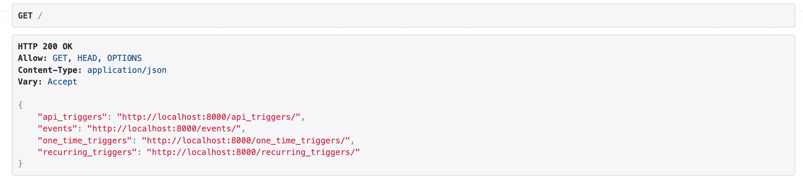

</details>
---


### **Create an API Trigger**
```
POST /api_triggers/
```
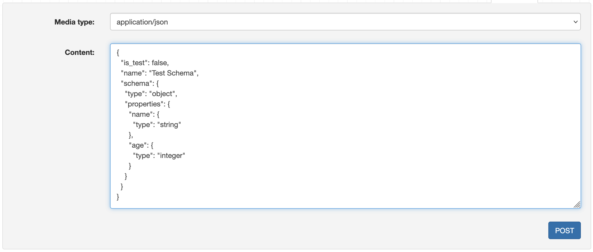

---


### **Get an API Trigger**
```
GET /api_triggers/<id>/
```
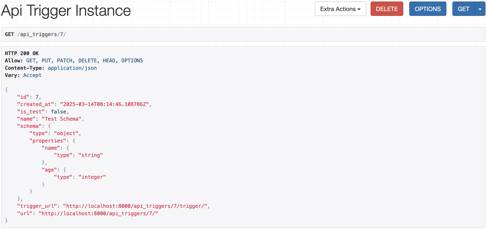


---


### **Update an API Trigger**

```
PUT, PATCH, DELETE /api_triggers/<id>/
```
<details>

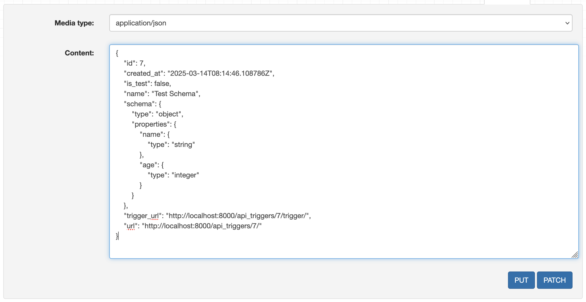

</details>


---


### **Triggering an API Trigger**

```
POST /api_triggers/<id>/trigger/
```

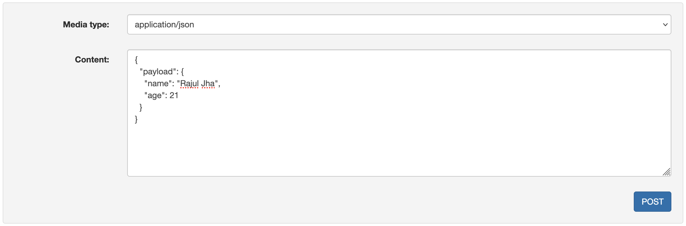

### **Response**
<details>

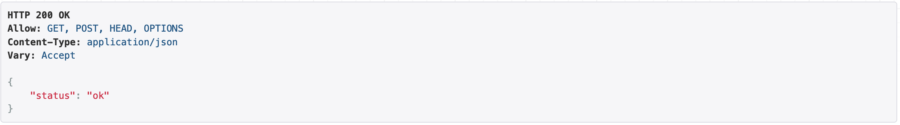

</details>

---


### **Create a Scheduled Onetime Trigger**

> [!NOTE]
> Please enter time in UTC format (timezone awareness is a WIP)


```
POST /one_time_triggers/
```

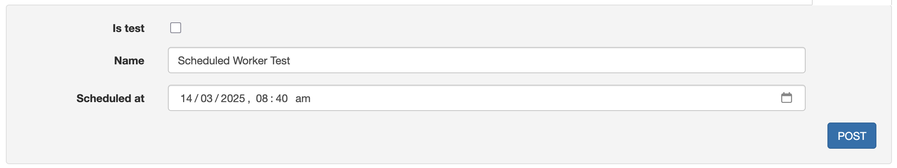

---


### **Get a Scheduled Onetime Trigger**
```
GET /one_time_triggers/<id>/
```
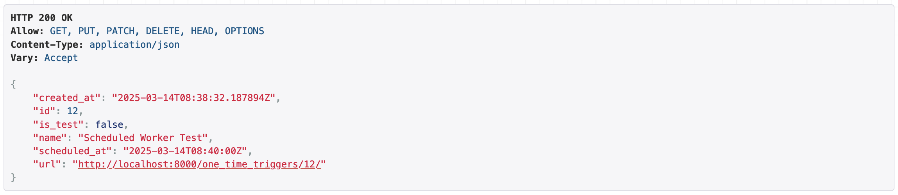

---

### **Update a Onetime Scheduled Trigger**

```
PUT, DELETE /one_time_triggers/<id>/
```
<details>

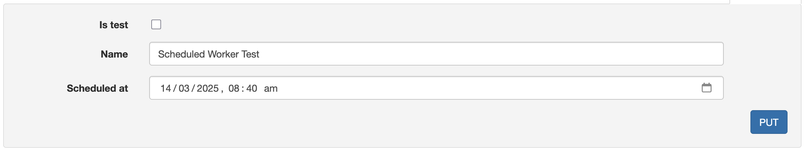

</details>

---


### **Create a Recurring Scheduled Trigger**

> [!TIP]
> Use https://crontab.guru for quickly creating crontab expressions

```
POST /recurring_triggers/
```

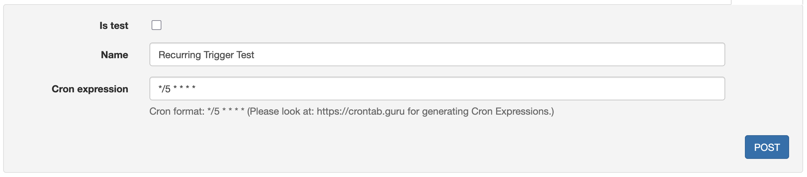

---


### **Get a Recurring Scheduled Trigger**
```
GET /recurring_triggers/<id>/
```
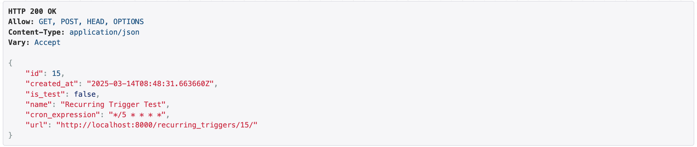


---


- **Update a Recurring Scheduled Trigger**
```
PUT, DELETE /recurring_triggers/<id>/
```
<details>

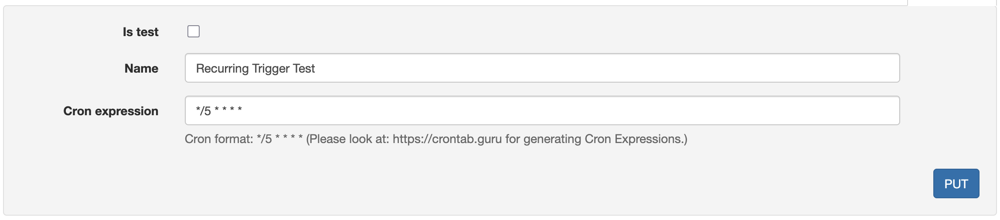

</details>

---


### **Get all Events**
```
GET /events/
```

> [!TIP]
> We can filter the results using the Filter button based on archived state and/or test state.

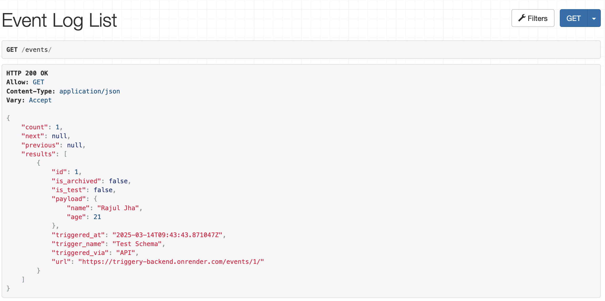


---

## Cost Analysis

The most important factors for running this analysis for this is our choice of deployment strategy, and the cloud. In this case, let us assume that we need to trigger roughly 10,000 recurring tirggers every day, 10,000 scheduled triggers and 15,0000 API triggers. This is roughly 25 tasks every minute. A suitable choice for running this load:


| Resource                             | On-demand hourly price | Approximate Monthly |
|--------------------------------------|------------------------|---------------------|
| Amazon RDS `db.db.t4g.micro`         | $0.016                 | $11.52              |
| Amazon Elasticache `cache.t4g.micro` | $0.0128                | $9.50               |
| Amazon EC2 `t2.micro` (web)          | $0.0116                | $8.50               |
| Amazon EC2 `t2.small` (celery loads) | $0.023                 | $16.50              |

That's roughly $46/month.
